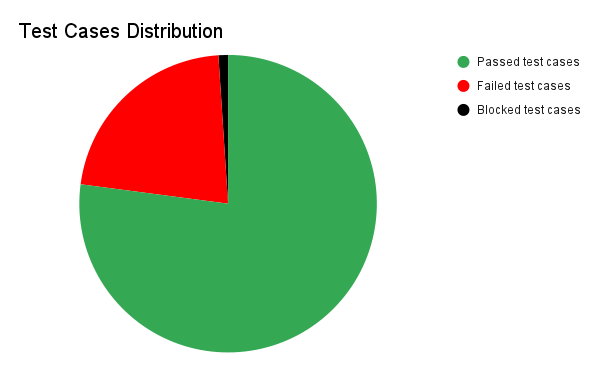

# QA Report: Foody Application

## 1. Executive Summary

This report summarizes the results of the initial test cycle for the Foody application, a manual QA project. A total of 96 test cases were executed, and 23 bugs and 7 queries were logged. The pass rate for the executed test cases is 77%, with a fail rate of 22%. The application has a significant number of critical and high-priority bugs that affect core functionality and user experience. There are also notable gaps in the requirements documentation, which prevents a full, comprehensive test from being performed.

## 2. Test Execution Metrics

This section provides a high-level overview of the test cases executed during this cycle.

- **Total Test Cases**: 96

- **Test Cases Executed**: 96

- **Passed Test Cases**: 74

- **Failed Test Cases**: 21

- **Blocked Test Cases**: 1

### Test Case Status

This chart provides a visual breakdown of the test case results.

## 3. Defect Summary

This section provides an overview of the defects and queries found during the test cycle.

- **Total Bugs Logged**: 23

- **Queries for Clarification**: 7

### Bugs by Severity

This chart shows the distribution of bugs by their severity level. The majority of bugs are of Major severity, indicating significant usability issues.

### Bugs by Priority

This chart shows the number of bugs based on their priority level, which helps the team determine the order of fixes.

## 4. Key Findings and Recommendations

Based on the initial test execution of the Foody application, a pass rate of 77% was achieved, and a large number of critical and systemic issues were identified.

### Key Findings

- **Critical Functionality Is Broken**: Three critical bugs were discovered, which indicates major defects in the core functionality of the application that require immediate attention.

- **High-Impact Issues**: There are a total of 6 high-severity bugs and 8 high-priority bugs, suggesting significant issues with core features and user workflows.

- **Systemic UI Problems**: Systemic issues were identified, such as missing visual indicators for required fields, which should be addressed with a single, global solution.

- **Missing Requirements**: A total of 7 queries were logged for missing or unclear requirements. This prevents the creation of a complete test plan and the full execution of testing.

### Recommendations
- **Prioritize Critical and High-Priority Bugs**: We recommend that the development team immediately address the 3 critical bugs and the 8 high-priority bugs.

- **Meet with the Product Owner**: It is recommended that we schedule a meeting with the Product Owner to review the 7 open queries. Without clarification on constraints and other requirements, further comprehensive testing cannot be performed.

- **Perform Regression Testing**: Once the identified bugs have been fixed, a full regression test should be performed to ensure that the fixes did not introduce any new issues.